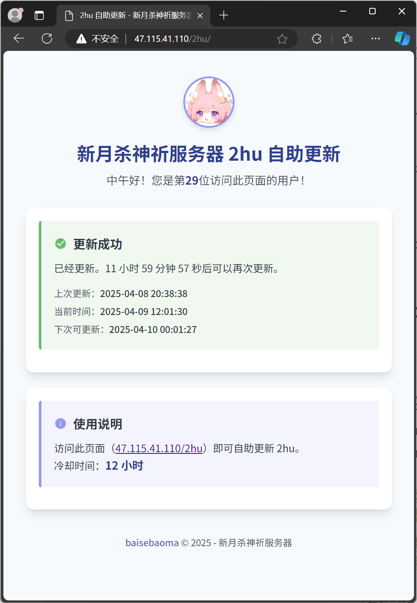
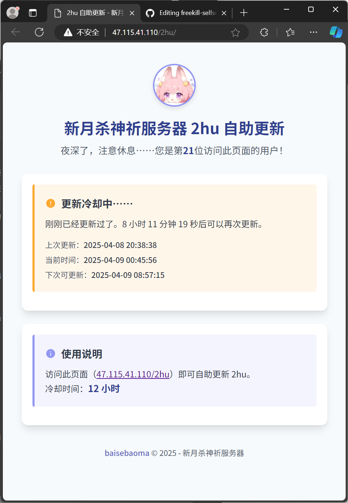

# FreeKill 扩展包自助更新网页接口 🕹️






很多时候 [新月杀（FreeKill）](https://github.com/Qsgs-Fans/FreeKill) 游戏服务器的主人（以下简称“服主”）和这个服务器上某个扩展包的开发者（以下简称“开发者”）并不是同一个人。开发者完成了某些开发并想推送到服务器上游玩，需要找服主帮忙。也许没有空——这导致开发者开发的最新不能即刻联机，是个非常沮丧的事情。之前有过每天定时使用自动脚本一键更新的设计，但当前由于游戏正处于重大开发阶段，一键更新所有扩展包到最新版本会产生各种问题，诸如报错、无法进入服务器等。

本仓库尝试以一种方式解决这个问题。经过缜密思考与设计，我推出并实现了这一方案：因为 FreeKill 服务端现已支持热更新，所以我们通过允许任何人自主更新（不用维护新的用户名和密码、不用告知任何人服务器密码、不授予任何新的权限），并设置较长（其实 12 小时对于这个任务并不长）的冷却时间，结合网页版多端支持、易于访问的特性，获得用户体验优秀的更新体验。也能反向督促开发者在 master 分支中提交最少 bug 的版本。

本项目的一个真实实例运行在 [这里](http://47.115.41.110/2hu/)。试试看！顺带一提，欢迎来我们的新月杀服务器：`47.115.41.110:9527`。

本仓库的代码以 [2hu](https://gitee.com/youmuKon-supreme/2hu) 扩展包为例。

## 🌟 核心特性

### 🚀 一键式自助更新
- ​**​简单操作，用户友好**​：任何玩家/开发者访问该网站即可触发更新，无需管理其他密码、无需向其他人共享服务器密码，解放服主；
- ​**​简易防护​**​：12 小时冷却时间硬性限制。

### ⚙️ 技术架构

网页请求 → PHP接口 → 执行2hu.sh → 返回Screen会话输出

## 📦 后端工作原理

```
#!/bin/bash
# 通过Screen会话执行更新命令
screen -S freekill -X stuff "u 2hu\n"
# 捕获输出并生成日志文件
grep -A 5 "Running command: \"u 2hu\"" /tmp/screen_output.XXXXXX
```

## 🛠️ 部署指南

### 前置要求

1. FreeKill服务器（需保持Screen会话运行）
2. PHP 7.0+ & Nginx/Apache
3. sudo权限（用于执行更新脚本）
4. 已经按[新月之书的相关内容](https://fkbook-all-in-one.readthedocs.io/zh-cn/latest/server/index.html)配置好服务器

### 安装步骤

#### 放置后端脚本

我是将 `2hu.sh` 放置在 `/usr/local/bin/` 下。你可以按自己的喜好来。

#### 部署前端

我是将 `index.php` 放置在 `/var/www/html/2hu` 下，这样访问 `[我的服务器]/2hu` 就可以。你可以按自己的喜好来。

#### 配置 Screen 会话

```
screen -S freekill -dm
```

#### 配置 sudoers，允许 www-data 用户执行特定 screen 命令​​

> 注意：当前版本的后端文件 `2hu.sh` 在被 PHP 执行时会有权限问题。如果你的 FreeKill 服务端是使用 `root` 用户创建的，那么无法返回输出结果（因为 PHP 使用的是 `www-data` 用户），但是可以正常执行代码。这也就是为什么前端并没有给出任何来自 FreeKill 服务端的输出。尝试了很多办法，暂时无法解决……

```
sudo visudo
```

在文件末尾添加：

```
www-data ALL=(root) NOPASSWD: /usr/bin/screen -r freekill
www-data ALL=(root) NOPASSWD: /usr/bin/screen -S freekill -X quit
www-data ALL=(root) NOPASSWD: /usr/bin/screen -S freekill -X stuff *
```

⚠️ 注意事项

1. ​​Screen 会话必须保持运行​​，否则会触发 `ERROR: Screen session not found`
2. FreeKill 服务端的 Screen 会话名字须为 `freekill`
3. 更新日志保存在 `/tmp/2hu_output.txt`
4. 冷却时间通过 `/tmp/2hu_lock.txt` 实现
5. 临时文件存储在 `/tmp/screen_output.XXXXXX`

## 遇到了问题？

请提 Issue，可以让更多人看到您的问题、后来者遇到相同的问题也有参考。当然，给我发邮件（[baisebaoma@foxmail.com](mailto:baisebaoma@foxmail.com)）也可以。

## Star History

如果觉得对您有用，请点一个 Star！

[](https://www.star-history.com/#baisebaoma/freekill-selfservice-updater&Date)

## 📜 协议声明

本项目采用 ​​GPL-3.0​​ 开源协议，任何衍生项目必须保持开源。
